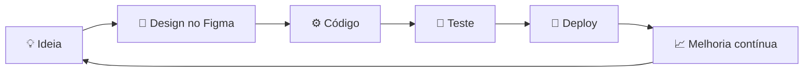

<div align="center">
  
</div>

<div align="center">
  <a href="https://github.com/pedrxmat7">
    
  </a>
</div>

<br>

<div align="center">
  
  
  
  
</div>

<br>

<div align="center">
  <a href="https://github.com/pedrxmat7?tab=followers">
    
  </a>
  
</div>

<br>

<div align="center">
  <a href="#sobre"></a>
  <a href="#needs"></a>
  <a href="#stack"></a>
  <a href="#processo"></a>
  <a href="#stats"></a>
  <a href="#contato"></a>
</div>


<a id="sobre"></a>

## `~/pedro $ whoami`

Sou desenvolvedor Full Stack e estou construindo minha carreira **na prática**: colocando projetos reais no ar, errando, corrigindo e evoluindo todo dia.

Pra mim, programar é uma ferramenta pra:

- 💰 **Gerar renda** com soluções que resolvem problemas reais
- 🕊️ **Construir liberdade** de tempo e de escolhas
- 🧠 **Desenvolver mentalidade**: disciplina, foco e visão de longo prazo

A tecnologia me chamou atenção desde cedo. Hoje ela virou rotina e compromisso.

```js
const pedro = {
  nome: "Pedro Henrique",
  papel: "Full Stack Developer",
  construindo: "NEEDS (SaaS mobile de marketplace de serviços)",
  design: "eu mesmo, no Figma",
  stack: ["React", "Node.js", "PHP", "Laravel", "MySQL", "PostgreSQL"],
  mentalidade: ["disciplina", "evolução diária", "foco em resultado"],
  objetivo: "Engenheiro de Software completo",
  status: "compilando o futuro... 🚀",

  aoAcordar() {
    return this.mentalidade.map((m) => `executar(${m})`);
  },
};
```


<a id="needs"></a>

## `~/pedro $ ./needs --run`

<table>
  <tr>
    <td>

**NEEDS** é um SaaS mobile de marketplace de serviços: conecta pessoas a profissionais de várias categorias, do agendamento ao atendimento.

Eu cuido do produto de ponta a ponta: **design de UI/UX no Figma**, **back-end**, **modelagem de banco de dados** e **gestão do projeto**.

</td>
  </tr>
</table>

| Módulo | O que eu aplico |
| :-- | :-- |
| 🎨 `produto.design` | Fluxos, telas e interface pensados no Figma antes de codar |
| ⚙️ `back.end` | Regras de negócio, APIs e integrações |
| 🗄️ `banco.dados` | Modelagem e relacionamento entre usuários, profissionais e serviços |
| ✅ `boas.praticas` | Código organizado, versionado e fácil de evoluir |

<details>
<summary><b>📦 git log do NEEDS (roadmap)</b></summary>

<br>

```bash
✔ feat: ideia e validação do conceito
✔ design: telas e interface no Figma
◻ feat: back-end e banco de dados
◻ feat: integração front-end e back-end
◻ test: testes com usuários reais
◻ release: lançamento 🚀
```

</details>


<a id="stack"></a>

## `~/pedro $ cat stack.json`

<div align="center">

**Linguagens, frameworks e bancos**


**Ferramentas**


</div>

<br>

<div align="center">
  
  
  
  
  
  
  
</div>

<br>

<div align="center">
  
  
  
  
  
</div>


<a id="processo"></a>

## `~/pedro $ git flow`



```diff
+ Disciplina > motivação
+ Evolução diária, mesmo que pequena
+ Foco em resultado
+ Construir projetos reais
- Esperar o momento perfeito
- Procrastinar em tutorial sem construir nada
```


## `~/pedro $ cat objetivos.md`

- [ ] 🏗️ Me tornar **Engenheiro de Software completo**, dominando o Full Stack
- [ ] 📈 Construir soluções escaláveis que gerem impacto real
- [ ] 🏢 Criar minhas próprias soluções e empresas
- [ ] 🌍 Trabalhar em projetos grandes e de alto impacto


<a id="stats"></a>

## `~/pedro $ github --stats`

<div align="center">
  
</div>

<div align="center">
  
  
  <br>
  
</div>

<div align="center">
  <br>
  
</div>

<div align="center">
  <br>
  
</div>


## `~/pedro $ ls projetos/`

| Projeto | Descrição | Stack |
| :-- | :-- | :-- |
| 🔹 **NEEDS** | SaaS mobile de marketplace de serviços que conecta usuários a profissionais | Full Stack · Figma · Banco de dados |

> 💡 `TODO:` novos projetos entram aqui conforme eu for publicando.


## `~/pedro $ ./collab.sh`

```bash
#!/bin/bash
echo "Aberto a:"
echo " 💼 Oportunidades como desenvolvedor Full Stack"
echo " 🚀 Parcerias em projetos e startups"
echo " 🧠 Trocar ideia com quem também está construindo"
```


<a id="contato"></a>

## `~/pedro $ ping pedro`

<div align="center">
  <a href="mailto:pedromatos999997@gmail.com">
    
  </a>
  <a href="https://www.linkedin.com/in/pedrohtech/">
    
  </a>
  <a href="https://instagram.com/sx_costax">
    
  </a>
</div>

<br>

<div align="center">
  
</div>

<br>


